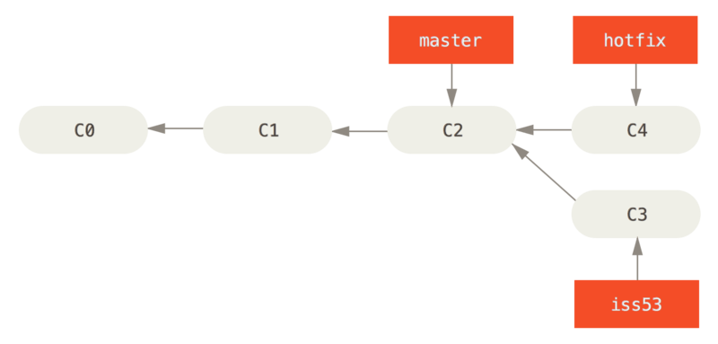

## Git Branching scenarios


### Scenario1: 


In the above scenarios, we have master branch at C2 commit, we have some production issue to fix, so hotfix branch is at commit C4, and working on some issue at commit C3 in branch iss53.

Now if we need to need to merge hotfix branch to master, how things will change in the git internally.

```text
$ git checkout master
$ git merge hotfix
Updating f42c576..3a0874c
Fast-forward
 index.html | 2 ++
 1 file changed, 2 insertions(+)
```

Git will follow fast-forward technique in this case.

**Fast-Forward is a merging way which will be applied when you try to merge one commit with a commit that can be reached by following the first commit's history,Git simplifies things by moving the pointer forward because there is no divergent work to merge together.**

Because the commit C4 pointed by hotfix branch you want to merge is directly ahead of the commit C2(pointed by master) you are on, so git simply moves the pointer and this is called fast-forward way of merge.


And now you can safely delete your hotfix branch as the changes got merged to master.
```text
$ git branch -d hotfix
Deleted branch hotfix (3a0874c)
```

### Scenario2:

Now continue the above case, We moved to iss53 branch and did some commit so the git becomes this:


Now you want to merge iss53 to master so you run the following command:
```text
$ git checkout master
Switched to branch 'master'
$ git merge iss53
Merge made by the 'recursive' strategy.
index.html |    1 +
1 file changed, 1 insertion(+)
``` 

Because the commit on the branch you’re on isn’t a direct ancestor of the branch you’re merging in, Git has to do some work.

**In this case, Git does a simple three-way merge, using the two snapshots pointed to by the branch tips(C4 and C5) and the common ancestor(C2) of the two.**


**Merge-Commit**: Instead of moving the pointer forward, Git creates a new snapshot from this 3-way merge and automatically creates a new commit that points to it.This commit is called merge commit, and is special in that it has more than one parent.


C6 is our new parent. 
Now you can safely delete iss53 branch.

### Scenario3:
Suppose you have some changes in file A.java in branch iss53. Someone else worked on master and did some other changes in the same file A.java in master branch.

Now you want to merge your iss53 branch to master.Git won’t be able to merge them cleanly, and it will look like this:

```text
$ git merge iss53
Auto-merging index.html
CONFLICT (content): Merge conflict in index.html
Automatic merge failed; fix conflicts and then commit the result.
``` 

Git hasn’t automatically created a new merge commit. It has paused the process while you resolve the conflict.Then you need to manually resolve the conflicts in git.


 

