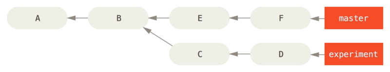

## Git Tools - Revision Selection

#### Short SHA-1
Git provides you commit which is having 40 characters SHA-1 hash. you can obviously refer a single commit with that hash.
Git also provides the facility of short SHA-1 hash where if you give some uniques characters from the commit then also git will recognize that commit.

```text
$ git log
commit 734713bc047d87bf7eac9674765ae793478c50d3
Author: Scott Chacon <schacon@gmail.com>
Date:   Fri Jan 2 18:32:33 2009 -0800

    fixed refs handling, added gc auto, updated tests

commit 1c002dd4b536e7479fe34593e72e6c6c1819e53b
Author: Scott Chacon <schacon@gmail.com>
Date:   Thu Dec 11 14:58:32 2008 -0800

    added some blame and merge stuff
```

Now using the last commit we can access it like this also:
```text
$ git show 1c002d
```

No need of giving entire commit hash.
Git generally believes that starting 8 to 10 characters are sufficient to uniquely identified a commit so if you run the following command
```text
$ git log --abbrev-commit --pretty=oneline
ca82a6d changed the version number
085bb3b removed unnecessary test code
a11bef0 first commit
```

you will see only 8 characters in the commit id.

#### Branch References
If you want to refer to a specific commit, and that commit is the tip of the branch(last commit of the branch) then both the below commands are same:
```text
$ git show ca82a6dff817ec66f44342007202690a93763949
$ git show topic1
```

Here, you are referring ca82a6 commit through branch references if this specific commit is the last commit of that branch.

#### RefLog Shortnames
When we used to work with our changes, git used to keep a reflog in background - **a log of where your HEAD and branch references have been for the last few months.**

```text
$ git reflog
734713b HEAD@{0}: commit: fixed refs handling, added gc auto, updated
d921970 HEAD@{1}: merge phedders/rdocs: Merge made by the 'recursive' strategy.
1c002dd HEAD@{2}: commit: added some blame and merge stuff
1c36188 HEAD@{3}: rebase -i (squash): updating HEAD
95df984 HEAD@{4}: commit: # This is a combination of two commits.
1c36188 HEAD@{5}: rebase -i (squash): updating HEAD
7e05da5 HEAD@{6}: rebase -i (pick): updating HEAD
```

All these changes are local and might change from machine to machine local work.

Every time your branch tip is updated for any reason, Git stores that information for you in this temporary history. You can use your reflog data to refer to older commits as well. For example, if you want to see the fifth prior value of the HEAD of your repository, you can use the @{5} reference that you see in the reflog output:
```text
$ git show HEAD@{5}
$ git show master@{yesterday}
```

Cool!!!

if you want to see commit logs present in reflog:
```text
$ git log -g master
commit 734713bc047d87bf7eac9674765ae793478c50d3
Reflog: master@{0} (Scott Chacon <schacon@gmail.com>)
Reflog message: commit: fixed refs handling, added gc auto, updated
Author: Scott Chacon <schacon@gmail.com>
Date:   Fri Jan 2 18:32:33 2009 -0800

    fixed refs handling, added gc auto, updated tests
```

#### Ancestry References
If you want refer some commit's parent commit then you can either use ~ , ^ or -
Below all are referring to the second parent of a commit.
```text
git show HEAD~2
git show HEAD--
git show HEAD^^
```

#### Commit Ranges
* Double Dot:-Double dot will show all commits reachable from experiment that aren’t reachable from master.



```text
$ git log master..experiment
D
C
```

* Triple Dot:-The last major range-selection syntax is the triple-dot syntax, which specifies all the commits that are reachable by either of two references but not by both of them

```text
$ git log master...experiment
F
E
D
C
```