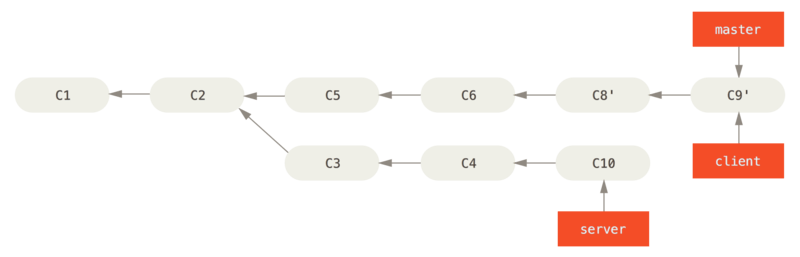

## Rebase With Topic Branch

Suppose you have master branch and you craeted one more branch(server) to do some server side coding and then from server branch you created one more branch client to do some client coding.


Now you want to integrate your client branch changes to master but you want to hold your server branch changes.
You can rebase client branch on master(for C8 and C9 commit) using --onto flag and it will not rebase the server branch.

```text
$ git rebase --onto master server client
```


Then as usual you need to merge you master branch to client branch.

```text
$ git checkout master
$ git merge client
```


```text
git rebase <basebranch> <topicbranch>
```

e.g., 
```text
$ git rebase master server
```
Above command helps you checking the topic branch(server) for you and replays it onto the base branch(master).


Then merge it with master branch and you are good to delete server and client branches.